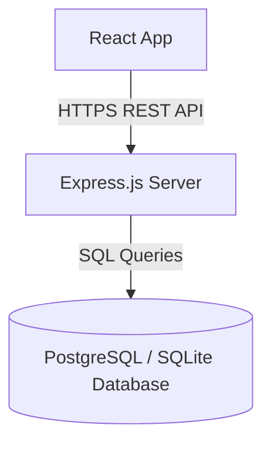

# AAMS Backend (Future Migration)

This directory is reserved for the backend API server. Below is the blueprint and mock endpoints to transition AAMS from client-side `localStorage` to a server database.

## Architecture Blueprint

## Mock Express Server Template
Create a `server.js` file with Node/Express to serve as the backend API. It would handle:
- GET `/api/units` - Retrieve all residential units
- POST `/api/units/update` - Modify occupant/furniture data
- GET `/api/bookings` - Retrieve guest house booking entries
- GET `/api/rent-settings` - Retrieve monthly default rent config
- POST `/api/rent-records` - Record cash-received rent payments
